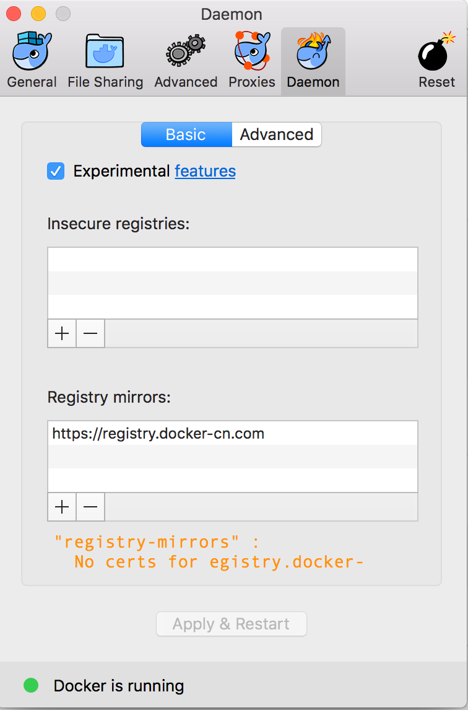

# mirrors
use mirrors in china to install some thrid packages

## Homebrew
```
export HOMEBREW_BOTTLE_DOMAIN="https://mirrors.ustc.edu.cn/homebrew-bottles"
```

## npm

```
add ~/.npmrc

registry=https://registry.npm.taobao.org
```

## pypi
```
add ~/.pip/pip.conf

[global]
index-url = http://pypi.douban.com/simple
```

## apm
install third packages in atom
```
apm config set registry https://registry.npm.taobao.org
```

## docker
add docker mirrors
</img>
